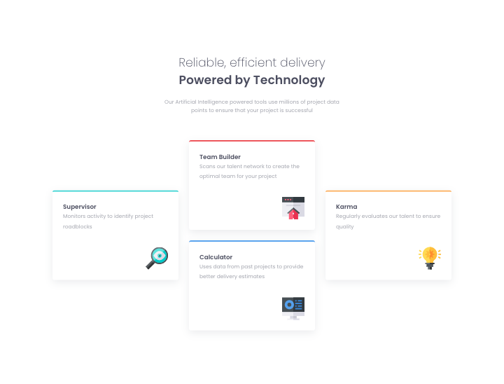

# Frontend Mentor - Four card feature section solution

This is a solution to the [Four card feature section challenge on Frontend Mentor](https://www.frontendmentor.io/challenges/four-card-feature-section-weK1eFYK). 
## Table of contents

- [Overview](#overview)
  - [The challenge](#the-challenge)
  - [Screenshot](#screenshot)
  - [Links](#links)
- [My process](#my-process)
  - [Built with](#built-with)
  - [What I learned](#what-i-learned)
  - [Continued development](#continued-development)

## Overview

### The challenge

Users should be able to:

- View the optimal layout for the site depending on their device's screen size

### Screenshot



### Links


- Solution URL: [https://github.com/Peteonthebeat/Four-Card-Feature-Section.git]
- Live Site URL: [Add live site URL here](https://your-live-site-url.com)

## My process
I lay down all the HTML first. Then I style the elements accordingly, and create the media queries. 

### Built with

- Semantic HTML5 markup
- CSS custom properties
- Flexbox
- CSS Grid
- Mobile-first workflow

### What I learned

I wouldn't say I learned anything new in particular. I rather exercised some flex and grid skills, while gaining confidence to attempt more sophisticated challenges. 

```HTML I'm proud of:
<section class="grid">
        <div class="item supervisor">
          <h3>Supervisor</h3>
          <p>Monitors activity to identify project roadblocks</p>
          <div class="img-wrapper">
            
          </div>
        </div>

        <div class="item team-builder">
          <h3>Team Builder</h3>
          <p>
            Scans our talent network to create the optimal team for your project
          </p>
          <div class="img-wrapper">
            
          </div>
        </div>

        <div class="item karma">
          <h3>Karma</h3>
          <p>Regularly evaluates our talent to ensure quality</p>
          <div class="img-wrapper">
            
          </div>
        </div>
        <div class="item calculator">
          <h3>Calculator</h3>
          <p>
            Uses data from past projects to provide better delivery estimates
          </p>
          <div class="img-wrapper">
            
          </div>
        </div>
      </section>
```CSS I'm proud of: 
@media (min-width: 1312px) {
    body {
      width: 100vw;
      height: 100vh;
      padding: 5em 10em;
      display: flex;
      flex-direction: column;
      align-items: flex-end;
      justify-content: center;

      .container {
        .delivery {
          max-width: 100em;
          margin: 0 20em 5em;
          h1 {
            font-size: 2.3em;
          }
          h2 {
            font-size: 2.3em;
            font-weight: 200;
          }
        }
        .grid {
          display: grid;
          grid-template-columns: repeat(6, 1fr);
          grid-template-rows: repeat(4, 1fr);
          grid-column-gap: 0px;
          grid-row-gap: 0px;
          gap: 2em;
          .item {
            margin: 0;
          }
          .supervisor {
            grid-area: 2 / 1 / 4 / 3;
          }
          .team-builder {
            grid-area: 1 / 3 / 3 / 5;
          }

          .karma {
            grid-area: 2 / 5 / 4 / 7;
          }
          .calculator {
            grid-area: 3 / 3 / 5 / 5;
          }
        }
      }
    }
  }
}

```

### Continued development
Attempting more sophisticated challenges and delving into JS...

## Author

- Website - [potb_tech](https://youtu.be/uMl9WCEc4RA)
- Frontend Mentor - [@peteonthebeat](https://www.frontendmentor.io/profile/peteonthebeat)
- Twitter - [@potb_tech](https://www.twitter.com/yourusername)
